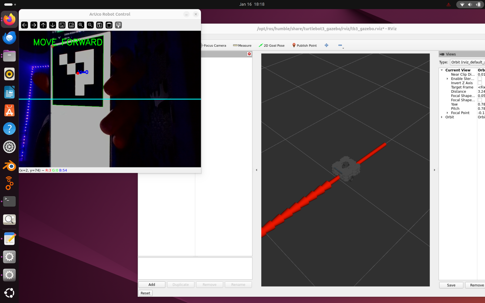
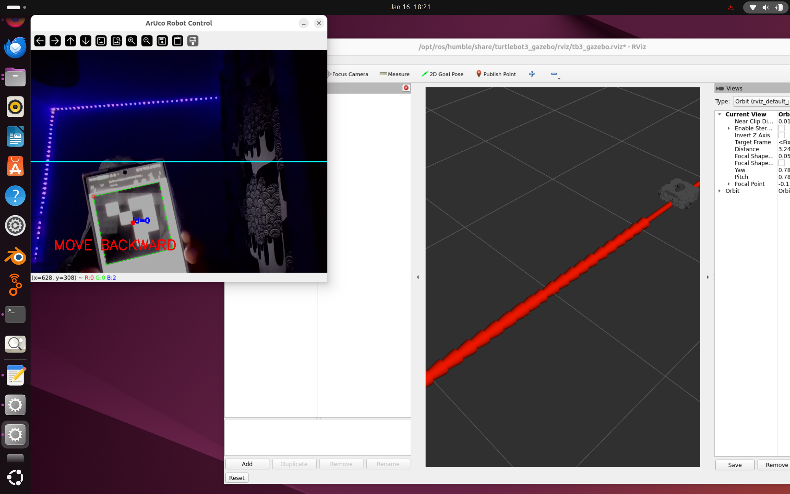
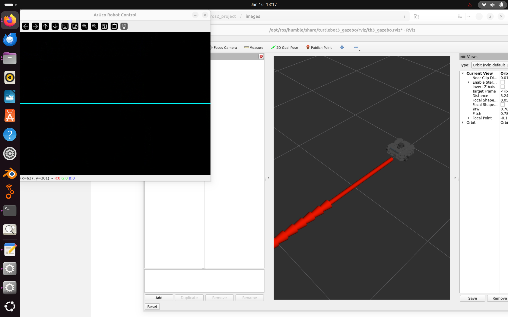

# ROS 2 ArUco Robot Control Project

## 1. Project Description
This project implements a visual control interface for a mobile robot (TurtleBot3) using ROS 2, Docker, and Computer Vision. Instead of manual keyboard control, the robot is controlled by detecting an **ArUco Marker** via a webcam.

The system uses a Dockerized environment to ensure compatibility across different machines. It integrates the `usb_cam` driver for real-time video feed and a custom ROS 2 Python node that processes images and sends velocity commands to the robot simulation.

### **Features**
* **Dockerized Environment:** One-click setup using Docker Compose.
* **Computer Vision Control:** Uses OpenCV to detect ArUco tags.
    * **Move Marker UP (Top half of screen):** Robot moves **FORWARD**.
    * **Move Marker DOWN (Bottom half of screen):** Robot moves **BACKWARD**.
    * **Hide Marker:** Robot **STOPS**.
* **Simulation & Visualization:** Runs alongside `RViz` and the TurtleBot3 waffle Node for visual feedback.
* **Launch System:** A single launch file starts the robot, camera, and controller simultaneously.

---

## 📂 Repository Structure
```text
ros2_project/
├── docker-compose.yml       # container & graphics
├── Dockerfile               # Builds ROS 2 Humble environment
├── README.md                # Project Doc
└── src/
    └── my_robot_control/
        ├── launch/
        │   └── project.launch.py  # Launches Camera + TurtleBo3 Node + Controller
        ├── my_robot_control/
        │   ├── __init__.py
        │   └── controller.py      # Main ArUco logic node
        ├── package.xml
        └── setup.py

```
---
## 🛠️ System Architecture

**Data Flow:**

```text
[Webcam] 
   │
   ▼ /image_raw
[ROS 2 Docker Container]
   │
   ▼ cv_bridge
[Controller Node]
   │
   ▼ Detect ArUco ID 0
   │
[Logic Processing] ──────────────┐
   │                             │
   ▼ /cmd_vel                    ▼ Overlay Graphics
[TurtleBot3 Simulation]       [User Display Window]
```

## 2. Prerequisites
Before running this project, ensure you have the following installed on your host machine:
* **Docker Engine** & **Docker Compose**
* **Git**
* **Webcam** (Built-in or USB)

---

## 3. Installation & Setup

### **Step 1: Clone the Repository**
Open your terminal and clone the project:
```
git clone https://github.com/TadAdane/Ros2_cam_node_project.git
cd Ros2_cam_node_project
```

### **Step 2: Start the Environment**
We use Docker to handle all ROS 2 dependencies. Run the following commands to allow GUI access and start the container:
```
xhost +local:docker
docker compose up -d
```

### **Step 3: Enter the Container**
All subsequent commands must be run inside the Docker container:
```
docker exec -it ros2_project bash
```

### **Step 4: Install Dependencies**
Inside the container, install the specific OpenCV and NumPy versions required to avoid conflicts with ROS 2 Humble:
```
pip3 install "numpy<2.0"
pip3 install "opencv-contrib-python==4.10.0.84"
```

### **Step 5: Build the Package**
Compile the ROS 2 package:
```
cd /root/ros2_ws
colcon build --symlink-install
source install/setup.bash
```
---

## 4. How to Run the Project

Once built, you can start the entire system (Robot + Camera + Controller) with a single command:
```
ros2 launch my_robot_control project.launch.py
```

**Control Instructions**

   1) Generate an [ArUco Marker](https://chev.me/arucogen/):

        - Use **Dictionary**: DICT_4X4(50,100,250,1000)

        - **ID**: 0

        - You can use this Online Generator and display it on your phone.

   2) Show the marker to the camera:

        - Hold the marker in the **Top Half** of the frame → Robot drives **Forward**.

        - Hold the marker in the **Bottom Half** of the frame → Robot drives **Backward**.

        - Remove the marker → Robot **Stops**.

---
## Demo

#### 🔼 Move Marker to Top Half: Robot moves FORWARD (Green Text).



#### 🔽 Move Marker to Bottom Half: Robot moves BACKWARD (Red Text).



#### 🚫 Hide Marker: Robot STOPS.


### Demo Video

A complete demonstration video of the system is available in the repository:
```
images/DemoVid.webm
```

---
## 5. Troubleshooting
- "Package not found": Run ```source install/setup.bash``` inside the ros2_ws folder.
- Graphics errors: If Gazebo/RViz crashes, ensure ```LIBGL_ALWAYS_SOFTWARE=1``` is set in ```docker-compose.yml```.

---
## 6. Authors
[Tadiwos Andargie](https://github.com/TadAdane)

- Core Docker environment setup & Camera fix.

- Basic Robot Controller Node implementation.

- Launch file creation (```project.launch.py```) & System integration.

[Daniel Manga](https://github.com/danielmenofgod)

- ArUco logic implementation & OpenCV integration.

- Fixing Python entry points and dependency conflicts (```numpy/LIBGL```).

- Documentation and environment variable configuration.

---
## License

This project is created for the TASFRS Group Project.
